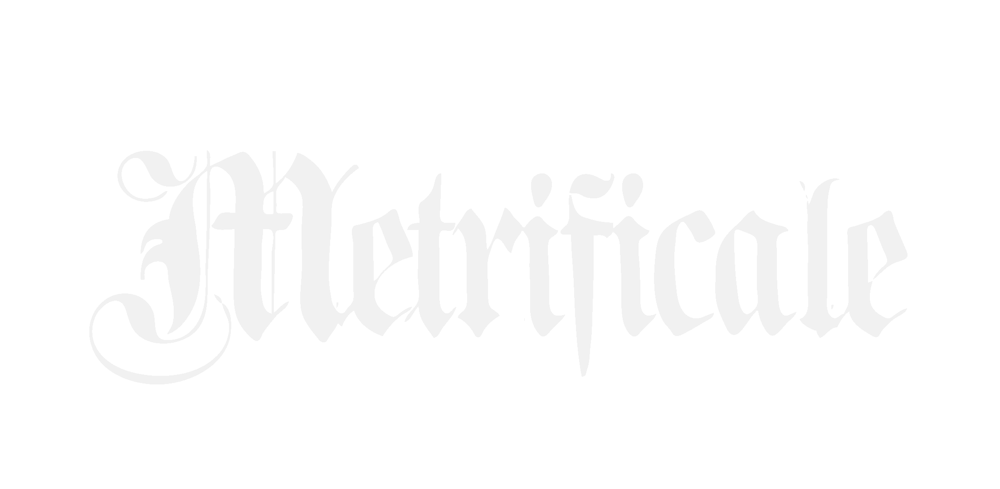

🇵🇱 Automatyczny analizator wersologiczny dla polskiej poezji

🇬🇧 An automatic versological analyzer for Polish poetry

```
Nam metrum meminit, curtat, amenificat.
```
- Marek z Opatowca, _Metrificale_

> Created with ❤ by Tytus Dunin

## 💡 Introduction
**Metrificale** is a Flask web app for versological analysis of Polish verse. It annotates stress and detects the numeric system, length, metre, caesura and rhyming patterns. 


## ⏬ Installation

Befor you can use Metrificale, you need to install the dependencies listed in `requirements.txt`. In short, you can install them with the command:

```
pip install flask pandas nltk numpy pyphen morfeusz2 kokosznicka araxne
```

After the dependencies are installed, you can clone the git repo:

```
git clone https://github.com/tytusdunin/metrificale.git
```

Finally, you can cd into the project folder and run the app.

```
cd metrificale
python app.py
```
Flask will display the local link on which te website is hosted.

## 🧭 Roadmap
✅ Creating a GitHub repo

❌ Completing the roadmap in README.md